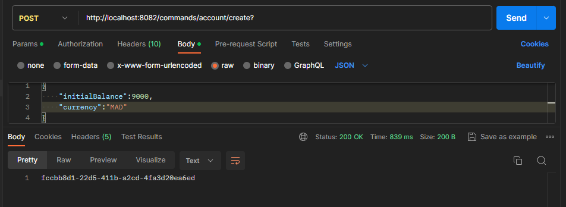
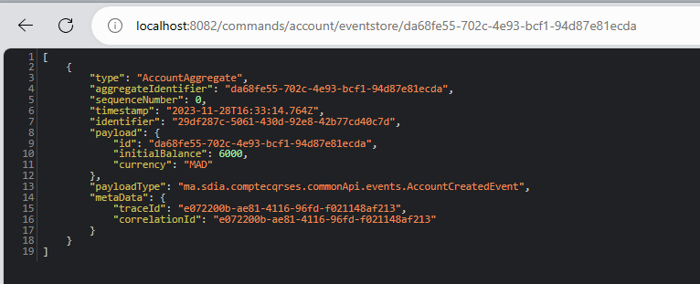

<h1>An application that allows us to manage accounts respecting <color style="color: burlywood">CQRS</color> and <color style="color: burlywood">Event Sourcing</color> patterns with the <color style="color: burlywood">AXON</color> and <color style="color: burlywood">Spring Boot </color>Frameworks</h1>

<h4>Creating accounts using Postman</h4>

Consulting the database after creating two account

domain_event_entry table

Payload : content of the event

<h4>Get an account from event store </h4>

