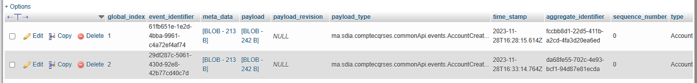
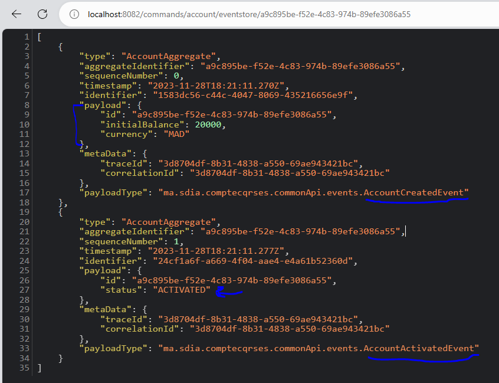

<h1>An application that allows us to manage accounts respecting <color style="color: burlywood">CQRS</color> and <color style="color: burlywood">Event Sourcing</color> patterns with the <color style="color: burlywood">AXON</color> and <color style="color: burlywood">Spring Boot </color>Frameworks</h1>

<h4>Creating accounts using Postman</h4>

Consulting the database after creating two account

domain_event_entry table

Payload : content of the event

<h4>Get an account from event store </h4>

<h4>Credit account</h4>

Add a negative amount Exception

Add an amount to the account that we already activate

<h4>Debit account</h4>

I created reading part (query) by using account service handler 

With this function i can stock all the accounts i was created before in the database

<pre>package ma.sdia.comptecqrses.query.service;

@Service
@AllArgsConstructor
@Slf4j
public class AccountServiceHandler {
private AccountRepository accountRepository;
private OperationRepository operationRepository;
@EventHandler
public void on(AccountCreatedEvent event){
log.info("*********************************");
log.info("AccountCreatedEvent received");
Account account=new Account();
account.setId(event.getId());
account.setCurrency(event.getCurrency());
account.setBalance(event.getInitialBalance());
account.setStatus(event.getStatus());
accountRepository.save(account);
}
}
</pre>

Here the status is Null, cuz i forgot to add it in events, so it doesn't register, i tried to creat another account, so it works.

I did the same thing for the Activated, Credited and debited events

<h4>Create, Credit, Debit</h4>
<h6>Create</h6>

<h6>Credit</h6>

<h6>debit</h6>

<h4>Operations</h4>

<h6>Account query controller</h6>

